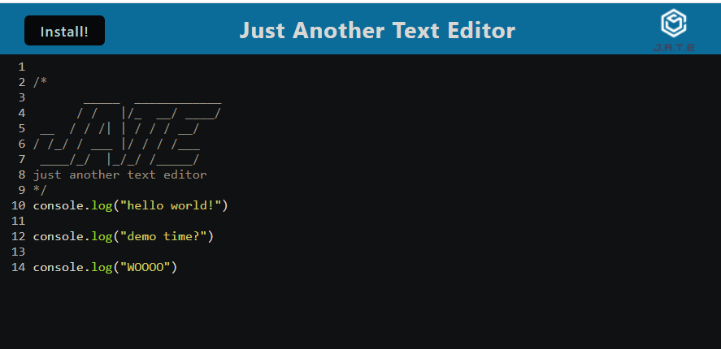
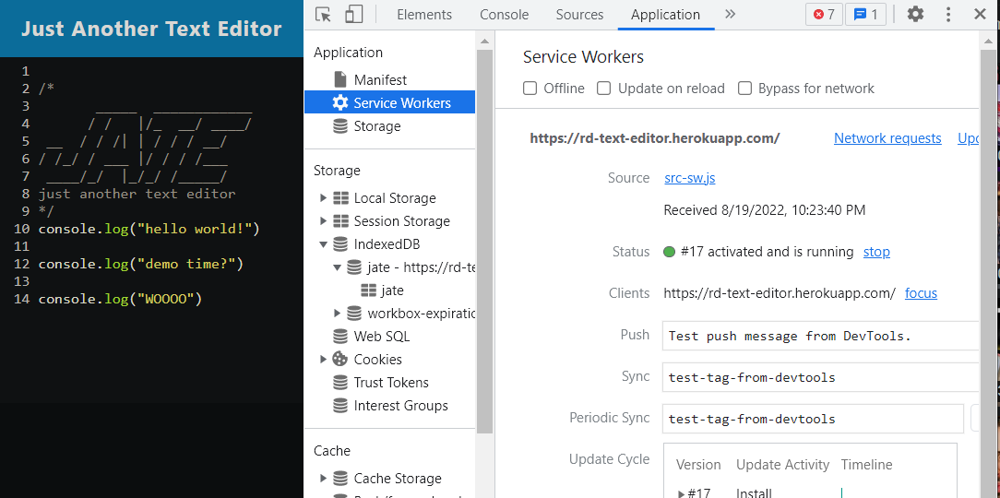

# An Example of A Progressive Web Application Using a Text Editor

## Description
Progressive web applications (PWA) are helpful tools that allow users to have something in between a website and a native app with even when there is little to no access to an internet connection. PWAs stand out from websites and regular apps in that they have lower load times compared to websites due to how they store data, and updates to the app will only change the relevant content, as opposed to apps to may require someone to re-download an entire application for an update. This project is meant to provide an example of a simple PWA using Webpack, a Javascript module bundler, and IndexedDB, a simple in-browser database that we use to store some data.

### Technologies
- Javascript (starter code provided)
- Node.js
- Express.js
- Webpack
- Babel
- Workbox
    - Service workers
- IndexedDB

## Installation Instructions 
```
npm i
```

## Usage Instructions
Enter your code/text within the text editor. To install the app version, click either the Install button at the top or the button at the end of the URL bar. This will open the app in a separate window where you can save text even while offline, until it can be opened up once more online. 

[Click here for the deployed version.](https://rd-text-editor.herokuapp.com/)

### Screenshots





## License
This project is MIT licensed. 

## Contact
- [GitHub](https://github.com/reversedentistry)
- Email: sherylhu@proton.me
